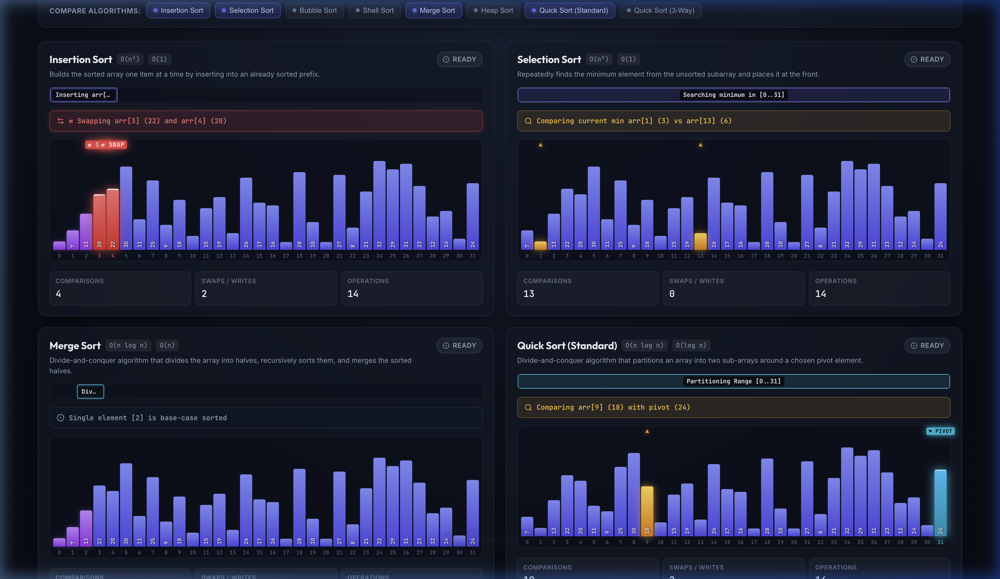

# SortViz — Comparative Sorting Algorithm Visualizer

[](https://sortviz-virid.vercel.app/)
[](LICENSE)

A modern, interactive web application inspired by [Toptal Sorting Algorithms](https://www.toptal.com/developers/sorting-algorithms) that visually animates, compares, and benchmarks 8 comparison-based sorting algorithms in synchronized lockstep on identical datasets.

🔗 **Live Deployment:** [https://sortviz-virid.vercel.app/](https://sortviz-virid.vercel.app/)



---

## ✨ Features

- **Side-by-Side Synchronized Comparison**: All active sorting algorithms execute in lockstep on the exact same array, highlighting real-world differences between $O(N \log N)$ and $O(N^2)$ complexities.
- **Visual Swap & Comparison Indicators**:
  - Floating red `⇄ SWAP` badges point to the exact elements being exchanged in real time.
  - Real-time **Operation Callout Banner** announces comparisons, swaps, and partition actions.
- **Divide-and-Conquer State Tracking**:
  - **Dynamic Range Trackers & Partition Bands**: Overarching brackets and tinted zones reveal active recursive subarrays $[L..R]$.
  - **Explicit Quick Sort Pivots**: Floating `⚑ PIVOT` pin in electric cyan marks the partition pivot throughout each step.
  - **Partially Sorted vs. Permanently Sorted**: Subproblems (e.g. merged segments in Merge Sort, prefixes in Insertion Sort) are distinctly tinted in **Purple**, while **Emerald Green** is strictly reserved for elements in their permanent sorted positions.
- **The 8 Core Comparison Algorithms**:
  - Insertion Sort
  - Selection Sort
  - Bubble Sort
  - Shell Sort
  - Merge Sort
  - Heap Sort
  - Quick Sort (Standard 2-Way)
  - Quick Sort (3-Way / Dutch National Flag)
- **Dataset Customization**:
  - **Sizes ($2^k$)**: $N \in \{8, 16, 32, 64, 128, 256\}$.
  - **Distributions**: Random, Reversed, Almost Sorted, and Few Unique.
- **Playback Engine**:
  - Continuous playback by default.
  - Optional **"Pause at every step"** toggle for micro-level algorithmic inspection.
  - Play, Pause, Step Forward, Stop / Reset, and adjustable Speed slider.

---

## 🏗 Architecture for AI Agents

Every sorting algorithm is implemented as a **pure TypeScript generator function** completely decoupled from React DOM and UI logic:

```typescript
export function* mergeSort(array: number[]): Generator<SortStep, void, unknown>
```

This strict separation allows AI agents to implement, debug, or extend sorting algorithms in total isolation and verify them headlessly via automated Vitest test suites.

Detailed architecture specifications are available in:
- [SPEC.md](SPEC.md)
- [docs/architecture.md](docs/architecture.md)

---

## 🚀 Getting Started

### Prerequisites
- Node.js 18+ and npm

### Installation
```bash
git clone https://github.com/<your-username>/sortviz.git
cd sortviz
npm install
```

### Development Server
```bash
npm run dev
```
Open `http://localhost:5173` in your browser.

### Automated Test Suite
Run the 128-test verification matrix checking sorted invariants, multiset conservation, and index safety across all algorithms, presets, and sizes:
```bash
npm test
```

### Production Build
```bash
npm run build
```

---

## 🌐 Deploying to Vercel

### Option 1: Via Vercel Dashboard (Recommended)
1. Push your repository to GitHub (see instructions below).
2. Go to [vercel.com](https://vercel.com) and log in.
3. Click **"Add New..."** -> **"Project"**.
4. Import your `sortviz` repository.
5. Vercel will automatically detect **Vite**:
   - **Framework Preset**: Vite
   - **Build Command**: `npm run build`
   - **Output Directory**: `dist`
6. Click **Deploy**. Your app will be live on a public `*.vercel.app` URL in seconds!

### Option 2: Via Vercel CLI
```bash
# Run without installing globally
npx vercel

# For production deployment
npx vercel --prod
```

---

## 🤖 Built with Antigravity AI

This application was designed, specified, and implemented collaboratively with **Antigravity** (Google DeepMind's Advanced Agentic Coding assistant).

- **Full Prompt & Interview Transcript**: See [docs/interview_transcript.md](docs/interview_transcript.md) for the exact initial prompt, step-by-step interview Q&A, and iteration logs for reproducibility.
- **Product Specification**: [SPEC.md](SPEC.md)
- **Architecture & AI Agent Design**: [docs/architecture.md](docs/architecture.md)

---

## 📄 License
MIT License. (c) 2026 Hyun Min Kang
