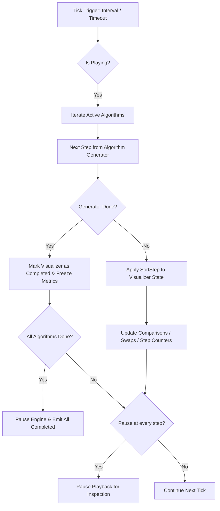

# Architecture & Design Document: SortViz

## 1. Architectural Philosophy for AI Agents

To maximize reliability when delegating tasks to AI agents, the architecture is built on three core tenets:

1. **Strict Separation of Concerns**:
   - **Algorithm Logic**: 100% pure TypeScript generator functions with zero DOM or UI dependencies.
   - **Engine / Scheduler**: Manages lockstep synchronization, play/pause state, and step iteration.
   - **Presentation Layer**: Pure, declarative React components that render snapshots of array bars, range brackets, and counter chips based on immutable step state.
2. **Standardized Algorithm Contract**:
   - Every sorting algorithm implements an identical, strongly-typed interface:
     ```typescript
     export function* algorithmName(array: number[]): Generator<SortStep, void, unknown>
     ```
   - Any AI agent can implement a new algorithm in an isolated file without modifying UI or scheduler code.
3. **Automated Verification Harness**:
   - Algorithms can be executed headlessly in Node/Vitest test suites to prove correctness across all array sizes and distributions before any UI integration.

---

## 2. Directory Structure

```text
sortviz/
├── docs/
│   └── architecture.md             # This document
├── SPEC.md                         # Product specification
├── src/
│   ├── types/
│   │   ├── algorithm.ts            # SortStep, RangeSpan, AlgorithmMeta, SortMetric
│   │   └── config.ts               # DistributionPreset, SizeConfig, EngineState
│   ├── algorithms/                 # Isolated pure algorithm generators
│   │   ├── insertionSort.ts
│   │   ├── selectionSort.ts
│   │   ├── bubbleSort.ts
│   │   ├── shellSort.ts
│   │   ├── mergeSort.ts
│   │   ├── heapSort.ts
│   │   ├── quickSort.ts
│   │   ├── quick3WaySort.ts
│   │   └── registry.ts             # Metadata registry of all 8 algorithms
│   ├── engine/
│   │   ├── generatorRunner.ts      # Advances algorithm step and updates metrics
│   │   ├── arrayGenerators.ts      # Random, Reversed, Almost Sorted, Few Unique
│   │   └── useSortEngine.ts        # React hook managing lockstep playback loop
│   ├── components/
│   │   ├── Header.tsx              # App banner and branding
│   │   ├── Controls/
│   │   │   ├── PlaybackControls.tsx# Play/Pause, Step, Reset, Speed Slider
│   │   │   ├── SizeSelector.tsx    # 2^k button group (8, 16, 32, 64, 128, 256)
│   │   │   ├── PresetSelector.tsx  # Distribution selector buttons
│   │   │   └── AlgorithmFilter.tsx # Multi-select checkboxes/chips
│   │   ├── Visualizer/
│   │   │   ├── ComparisonGrid.tsx  # Responsive container for active cards
│   │   │   ├── VisualizerCard.tsx  # Individual algorithm card
│   │   │   ├── RangeIndicator.tsx  # Subarray brackets / tinted partition bands
│   │   │   ├── ArrayBars.tsx       # Bars with state-based color styling
│   │   │   └── MetricsPanel.tsx    # Comparisons, Swaps, Steps, Status chips
│   │   └── Common/
│   │       └── Tooltip.tsx
│   ├── styles/
│   │   ├── index.css               # Design system tokens, color palette, glassmorphism
│   │   └── animations.css          # Bar transitions and highlight pulses
│   ├── tests/
│   │   └── algorithms.test.ts      # Vitest test suite proving all 8 algorithms
│   ├── App.tsx                     # Main layout and state wiring
│   └── main.tsx                    # React DOM entry point
├── public/                         # Static assets, favicon, OG preview image
├── index.html                      # Semantic HTML5 entry with meta tags
├── package.json
├── tsconfig.json
├── vite.config.ts
└── vercel.json                     # Vercel deployment configuration
```

---

## 3. The Algorithm Engine Contract (`src/types/algorithm.ts`)

Algorithms communicate with the visualizer by yielding discrete, immutable `SortStep` events.

```typescript
export type StepType = 
  | 'compare'       // Evaluating values at indices [i, j]
  | 'swap'          // Exchanging values at indices [i, j]
  | 'overwrite'     // Writing value directly to index i (used in Merge Sort)
  | 'set-pivot'     // Marking index as pivot (used in Quick Sort)
  | 'clear-pivot'   // Clearing pivot state
  | 'set-range'     // Declaring active subarray range [start, end] with purpose tag
  | 'clear-range'   // Clearing active range
  | 'mark-sorted'   // Marking indices as finalized/sorted

export interface RangeSpan {
  start: number;
  end: number;
  label?: string;          // e.g. "Partition [0..15]", "Merging [0..7] and [8..15]"
  variant?: 'active' | 'partition' | 'left-merge' | 'right-merge';
}

export interface SortStep {
  type: StepType;
  indices?: number[];      // Involved array indices
  value?: number;          // For 'overwrite' operations
  range?: RangeSpan;       // For 'set-range' operations
  description?: string;    // Human-readable debug description
}

export interface AlgorithmMetadata {
  id: string;
  name: string;
  timeComplexity: {
    best: string;
    average: string;
    worst: string;
  };
  spaceComplexity: string;
  stable: boolean;
  defaultSelected: boolean;
  run: (array: number[]) => Generator<SortStep, void, unknown>;
}
```

---

## 4. Playback Engine & Step Synchronization

The playback engine drives all active visualizer cards in lockstep:



### Continuous Playback & Stepwise Mode
By default, the engine operates in **continuous playback mode**, scheduling subsequent ticks via `setTimeout(tick, speedMs)` until all visualizers complete. When the user enables the **Pause at every step** toggle, the engine advances exactly one lockstep operation and pauses immediately, allowing granular single-step inspection.

### State Machine per Visualizer Card
Each algorithm card maintains:
- `currentArray: number[]`: The live array values.
- `barStates: Map<number, BarState>`: Color role per bar (`default`, `comparing`, `swapping`, `pivot`, `locally-sorted`, `globally-sorted`).
- `activeRanges: RangeSpan[]`: Currently rendered brackets/tinted zones above bars.
- `metrics: { comparisons: number, swaps: number, steps: number }`.
- `status: 'idle' | 'running' | 'completed'`.

---

## 5. Visual Design System & Aesthetics

### Color Palette (Tailored HSL / Dark Mode)
- **Background**: Deep obsidian slate (`#0b0f19` / `rgb(11, 15, 25)`).
- **Surface / Cards**: Elevated frosted glass (`rgba(30, 41, 59, 0.7)` with `backdrop-filter: blur(12px)` and subtle 1px border `rgba(255, 255, 255, 0.08)`).
- **Typography**: Inter / Outfit via Google Fonts for sleek readability.
- **Bar States**:
  - `Default`: Soft Indigo (`#6366f1`)
  - `Comparing`: Golden Amber (`#f59e0b`) with pulse glow
  - `Swapping`: Vibrant Crimson (`#ef4444`)
  - `Pivot`: Electric Cyan (`#06b6d4`)
  - `Partition / Range Highlight`: Translucent violet band (`rgba(139, 92, 246, 0.15)`)
  - `Completed / Sorted`: Emerald Green (`#10b981`) with soft radiance

### Range Indicators (Requirement 4 Implementation)
Above each card's bar chart, a dedicated 18px **Range Track** renders dynamic SVG/HTML brackets:
- Shows the span of the active recursive subarray: $[L, R]$.
- Displays an inline tag indicating subproblem state (e.g. `Lomuto Partition [0..15]`, `Merge Left [0..3]`, `Merge Right [4..7]`).

---

## 6. AI Agent Implementation Tasks (Work Breakdown)

Because the architecture decouples logic, state, and rendering, an AI agent can execute the build through isolated, testable modules:

- **Task 1: Foundation & Typing**
  - Setup Vite + React + TypeScript project with ESLint and Vitest.
  - Define interfaces in `src/types/algorithm.ts` and `src/types/config.ts`.
  - Configure CSS design tokens in `src/styles/index.css`.
- **Task 2: Input Generation & Vitest Test Harness**
  - Implement array generators (`random`, `reversed`, `almostSorted`, `fewUnique`) for $N \in \{8, 16, 32, 64, 128, 256\}$.
  - Setup headless test harness `src/tests/algorithms.test.ts`.
- **Task 3: Implement the 8 Sorting Generators**
  - Implement Insertion, Selection, Bubble, Shell, Merge, Heap, Quick (2-Way), Quick (3-Way).
  - Run `npm run test` to mathematically guarantee all 8 algorithms correctly sort and emit valid range/step events.
- **Task 4: Playback Engine Hook**
  - Build `useSortEngine.ts` handling step synchronization, lockstep execution, play/pause, step forward, and reset.
- **Task 5: UI Components & Visualizer Cards**
  - Build `ArrayBars.tsx` and `RangeIndicator.tsx` with dynamic brackets.
  - Build `VisualizerCard.tsx` with metrics and status badges.
  - Build `PlaybackControls.tsx`, `SizeSelector.tsx`, `PresetSelector.tsx`, and `AlgorithmFilter.tsx`.
- **Task 6: Verification & Vercel Readiness**
  - Test responsive layout on mobile/tablet/desktop.
  - Test edge cases (controls disabled during execution, graceful freeze on early completion).
  - Configure `vercel.json` for static SPA deployment.
